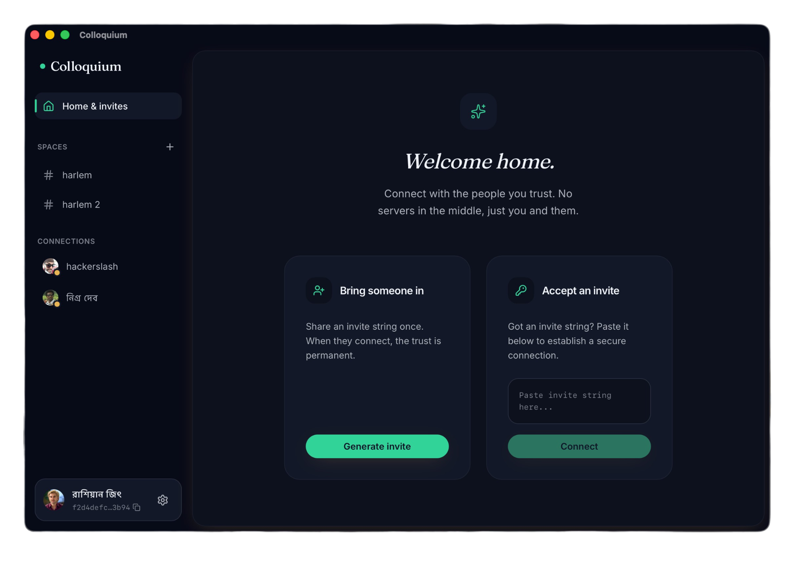

<div align="center">

# Colloquium

**A Discord-style peer-to-peer desktop app for text chat, voice/video rooms, and watch parties — with no server in the middle.**

[](https://github.com/hackerslash/colloquium/actions/workflows/ci.yml)
[](https://github.com/hackerslash/colloquium/releases/latest)
[](LICENSE)


[Download](#install) · [Features](#features) · [How it works](#how-it-works) · [Development](#development) · [Contributing](CONTRIBUTING.md)



</div>

---

Colloquium looks and works like Discord — spaces, rooms, calls, screen sharing —
but there is no backend to trust, pay for, or operate. Messages, calls, and files
go directly between peers over WebRTC, and your history lives in an encrypted
SQLite database on your own machine. No account, no server-side copy, nothing to
sign up for.

## Features

**Chat**
- Persistent text chat in direct messages and group rooms, with replies,
  edit/delete, reactions, pinned messages, and typing indicators
- Markdown, @-mentions with autocomplete, an emoji picker, and animated emoji
- Voice messages — record with pause/resume, review before sending, and each one
  carries its own waveform
- File attachments up to 25 MB by drag-and-drop, paste, or picker. A file that
  arrived while you were offline can be fetched from its sender later
- Drafts survive quitting, and a conversation can be exported to Markdown

**Calls**
- 1:1 and multi-party room voice/video over WebRTC
- Screen sharing with selectable quality tiers, plus native system-audio capture
  on macOS
- Live voice isolation and noise suppression
- Push-to-talk, speaking indicators, and a floating always-on-top call window

**Watch party**
- Watch a local video file in sync with a room — one controller drives playback
  for everyone
- Paste a YouTube link and it plays on the same stage as a file, in sync and
  titled — resolved to a stream by a bundled yt-dlp, with no download and none
  of YouTube's own chrome
- Audio-track and subtitle selection follow the controller
- Files that a browser engine can't play natively are remuxed on the fly by a
  bundled ffmpeg, so HEVC, AC3/E-AC3/DTS/TrueHD and multi-track files work
- If the controller disappears, the remaining viewers elect a new one and the
  film carries on

**The app itself**
- ⌘K quick switcher across people, rooms, and messages
- Desktop notifications with per-room mutes and a global snooze
- Interface scaling (⌘+ / ⌘− / ⌘0) and a shortcut sheet (⌘/)
- System tray, dark-first design
- Optional start-at-login that launches straight to the tray, so your rooms
  keep a peer online without a window open

## How it works

There is no application server. Colloquium uses the free public
[PeerJS](https://peerjs.com/) cloud broker purely to introduce peers to each
other, plus a TURN relay for networks that block direct connections. Once two
peers are connected, all traffic — messages, file chunks, media, watch-party
state — flows over WebRTC directly between them.

- **Identity** is an Ed25519 keypair generated on first launch. The private seed
  is stored in the OS keychain (macOS Keychain / Windows Credential Manager),
  never on disk in the clear. Every message is signed, so authorship is
  verifiable rather than asserted.
- **Verification** closes the one gap the broker leaves. Signatures prove a
  message came from the key you hold — they can't prove that key is your
  friend's, since invites travel over whatever channel you used to send them.
  Each pair of contacts has a 60-digit safety number derived from both public
  keys; compare it over a call or in person and a substituted key can't match.
- **Storage** is local SQLite, encrypted at rest with SQLCipher using a key held
  in the same OS keychain.
- **Transport** is WebRTC, so peer traffic is encrypted in transit (DTLS/SRTP) and
  a TURN relay only ever forwards ciphertext.
- **Sync** is peer-to-peer. Each room member tracks the highest *contiguous*
  message sequence it holds per author, so a peer that reconnects backfills the
  gaps rather than assuming it is up to date.

Because history is local and peer-to-peer, a room is only as available as its
members: if nobody who holds a message is online, it can't be fetched.

## Install

Grab the installer for your platform from the
[latest release](https://github.com/hackerslash/colloquium/releases/latest).

**macOS** — universal `.dmg` (Apple Silicon + Intel)

1. Move `Colloquium.app` into `/Applications`.
2. Run this once. The build isn't notarized, so without it macOS re-prompts for
   Screen Recording / Camera / Mic on every relaunch:
   ```sh
   curl -fsSL https://raw.githubusercontent.com/hackerslash/colloquium/main/scripts/fix-macos-permissions.sh | bash
   ```
3. Open Colloquium and grant permissions when prompted.

**Windows** — `.exe` (NSIS) or `.msi`

Run the installer, then launch Colloquium from the Start menu.

## Development

Prerequisites: [Node.js](https://nodejs.org/) 22+ with
[pnpm](https://pnpm.io/), [Rust](https://www.rust-lang.org/tools/install), and
the [Tauri platform dependencies](https://tauri.app/start/prerequisites/).

```sh
pnpm install
pnpm tauri:dev
```

Watch party needs `ffmpeg`/`ffprobe` and `yt-dlp`, but **you don't install
them** — they're bundled sidecars that `pnpm tauri:dev` downloads and
checksum-verifies before the first build. To fetch them ahead of time, run
`pnpm ffmpeg` and `pnpm ytdlp`. ffmpeg is built from source by CI to stay
LGPL-2.1 and small (~13 MB each); yt-dlp is the upstream release binary. See
[THIRD-PARTY.md](THIRD-PARTY.md).

```sh
pnpm typecheck                            # tsc, both configs
pnpm test                                 # vitest
cargo test --manifest-path src-tauri/Cargo.toml
pnpm build                                # typecheck + production frontend build
pnpm tauri build                          # installers for the current platform
```

If `pnpm install` fails with `ERR_PNPM_MINIMUM_RELEASE_AGE_VIOLATION`, your
machine has a global pnpm supply-chain policy blocking recently-published
packages. The lockfile pins exact, vetted versions, so install once with the
guard relaxed:

```sh
pnpm install --config.minimum-release-age=0
```

**IDE setup**: [VS Code](https://code.visualstudio.com/) +
[Tauri extension](https://marketplace.visualstudio.com/items?itemName=tauri-apps.tauri-vscode) +
[rust-analyzer](https://marketplace.visualstudio.com/items?itemName=rust-lang.rust-analyzer).

### Layout

```
src/
  components/   React UI, grouped by surface (chat, call, room, settings, ui)
  services/     Domain logic: peer, room, call, watchparty, db, identity
  stores/       Zustand state
src-tauri/src/  Rust: SQLCipher database, Ed25519 identity, OS keychain,
                macOS system-audio capture, tray
```

`design.md` is the locked design system every UI surface follows.

## Contributing

Issues and pull requests are welcome — see [CONTRIBUTING.md](CONTRIBUTING.md)
for setup, conventions, and what CI expects. Notable changes are recorded in
[CHANGELOG.md](CHANGELOG.md).

## License

[MIT](LICENSE) © Md Afridi Sk

Bundled third-party components, including the LGPL-2.1 ffmpeg sidecars, are
documented in [THIRD-PARTY.md](THIRD-PARTY.md).
